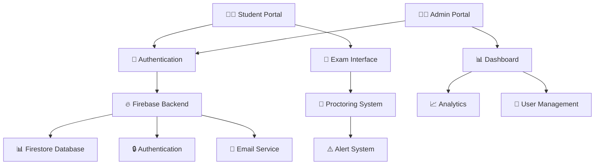

<div align="center">

# 🎓 ExamGuard Pro

### *Secure • Smart • Scalable Proctored Examination Platform*

[](https://reactjs.org/)
[](https://www.typescriptlang.org/)
[](https://firebase.google.com/)
[](https://tailwindcss.com/)


[🚀 Live Demo](#) • [📖 Documentation](#features) • [🎯 Features](#features) • [💻 Installation](#installation)

</div>

---

## 🌟 Overview

**ExamGuard Pro** is a next-generation proctored examination platform designed for educational institutions, coaching centers, and online learning platforms. Built with cutting-edge technologies, it ensures exam integrity through advanced monitoring while providing a seamless experience for both students and administrators.

<div align="center">

### 🎯 Perfect For

| 🏫 Schools | 🎓 Universities | 📚 Coaching Centers | 💼 Corporate Training |
|:---:|:---:|:---:|:---:|
| Board Exams | Entrance Tests | Competitive Exams | Certification Tests |

</div>

---

## ✨ Key Features

<table>
<tr>
<td width="50%">

### 🔐 **Security & Proctoring**
- 🎥 Real-time screen monitoring
- 🚫 Tab switching detection
- 🔒 Fullscreen enforcement
- 📸 Periodic snapshots
- 🛡️ Anti-cheat mechanisms
- 🔕 Copy-paste disabled
- ⚠️ Suspicious activity alerts

</td>
<td width="50%">

### 👨‍🎓 **Student Features**
- 📝 Scheduled exam access
- ⏱️ Live timer with warnings
- 🔖 Question bookmarking
- 📊 Instant result viewing
- 🏆 Certificate generation
- 📈 Performance analytics
- 📱 Responsive design

</td>
</tr>
<tr>
<td width="50%">

### �‍💼 **Admin Dashboard**
- 📅 Exam scheduling
- 📤 CSV bulk import
- 👥 Student management
- 📊 Real-time monitoring
- 📧 Email notifications
- 🎯 Result management
- 📈 Analytics & reports

</td>
<td width="50%">

### 🎨 **User Experience**
- 🌓 Dark/Light mode
- 🎭 Smooth animations
- 🚀 Fast performance
- 📱 Mobile responsive
- ♿ Accessibility ready
- 🌐 Multi-language support
- 💫 Modern UI/UX

</td>
</tr>
</table>

---

## 🏗️ Architecture

<div align="center">



</div>

---

## 🛠️ Tech Stack

<div align="center">

### Frontend


### Backend & Services


### Tools & Libraries


</div>

---

## 📦 Installation

### Prerequisites

```bash
Node.js >= 18.0.0
npm >= 9.0.0
Firebase Account
```

### Quick Start

```bash
# 1️⃣ Clone the repository
git clone https://github.com/yourusername/examguard-pro.git
cd examguard-pro

# 2️⃣ Install dependencies
npm install

# 3️⃣ Configure Firebase
# Create .env file and add your Firebase credentials
cp .env.example .env

# 4️⃣ Start development server
npm run dev

# 🚀 Open http://localhost:5173
```

### Environment Variables

Create a `.env` file in the root directory:

```env
VITE_FIREBASE_API_KEY=your_api_key
VITE_FIREBASE_AUTH_DOMAIN=your_auth_domain
VITE_FIREBASE_PROJECT_ID=your_project_id
VITE_FIREBASE_STORAGE_BUCKET=your_storage_bucket
VITE_FIREBASE_MESSAGING_SENDER_ID=your_sender_id
VITE_FIREBASE_APP_ID=your_app_id
```

---

## 🎯 Usage Guide

### For Students

1. **📝 Register/Login** - Create account or login with credentials
2. **📅 View Scheduled Exams** - Check upcoming exams in dashboard
3. **📖 Read Instructions** - Review exam rules before starting
4. **✍️ Take Exam** - Answer questions within time limit
5. **📊 View Results** - Check scores and download certificates

### For Administrators

1. **🔐 Admin Login** - Access admin portal with credentials
2. **➕ Create Exam** - Schedule new exam with details
3. **📤 Import Questions** - Upload CSV with questions
4. **👥 Manage Students** - Add/remove student access
5. **📊 Monitor Exams** - Real-time exam monitoring
6. **📈 View Analytics** - Check performance reports

---

## 📊 Features in Detail

### 🔐 Proctoring System

<details>
<summary><b>Click to expand proctoring features</b></summary>

- **Fullscreen Lock**: Exam automatically enters fullscreen mode
- **Tab Switch Detection**: Alerts when student switches tabs
- **Copy-Paste Prevention**: Disabled during exam
- **Right-Click Disabled**: Context menu blocked
- **Developer Tools Blocked**: F12 and inspect disabled
- **Time Tracking**: Precise time management
- **Auto-Submit**: Automatic submission on time expiry

</details>

### 📝 Question Management

<details>
<summary><b>Click to expand question features</b></summary>

- **CSV Import**: Bulk upload questions via CSV
- **Multiple Choice**: Support for MCQ format
- **Subject Categorization**: Organize by subjects
- **Question Bank**: Reusable question repository
- **Random Selection**: Randomize question order
- **Difficulty Levels**: Easy, Medium, Hard classification

</details>

### 📊 Analytics & Reporting

<details>
<summary><b>Click to expand analytics features</b></summary>

- **Performance Metrics**: Detailed score analysis
- **Subject-wise Reports**: Performance by subject
- **Time Analysis**: Time spent per question
- **Comparative Analysis**: Student ranking
- **Export Reports**: Download as PDF/Excel
- **Visual Charts**: Graphs and charts

</details>

---

## 🎨 Screenshots

<div align="center">

### 🏠 Landing Page


### 📝 Exam Interface


### 📊 Admin Dashboard


### 🏆 Certificate


</div>

---

## 📁 Project Structure

```
examguard-pro/
├── 📂 src/
│   ├── 📂 components/
│   │   ├── 📂 admin/          # Admin components
│   │   ├── Certificate.tsx    # Certificate generator
│   │   ├── Exam.tsx          # Exam interface
│   │   ├── Header.tsx        # Navigation header
│   │   ├── Results.tsx       # Results display
│   │   └── ...
│   ├── 📂 context/           # React context
│   ├── 📂 firebase/          # Firebase config
│   ├── 📂 services/          # API services
│   ├── 📂 types/             # TypeScript types
│   ├── 📂 utils/             # Utility functions
│   └── App.tsx               # Main app component
├── 📂 public/                # Static assets
├── 📄 package.json           # Dependencies
├── 📄 tsconfig.json          # TypeScript config
├── 📄 tailwind.config.js     # Tailwind config
└── 📄 vite.config.ts         # Vite config
```

---

## 🚀 Deployment

### Deploy to Vercel

```bash
# Install Vercel CLI
npm i -g vercel

# Deploy
vercel --prod
```

### Deploy to Netlify

```bash
# Build the project
npm run build

# Deploy dist folder to Netlify
```

### Deploy to Firebase Hosting

```bash
# Install Firebase CLI
npm install -g firebase-tools

# Login to Firebase
firebase login

# Initialize Firebase
firebase init hosting

# Deploy
firebase deploy
```

---

## 🤝 Contributing

We welcome contributions! Please follow these steps:

1. 🍴 Fork the repository
2. 🌿 Create a feature branch (`git checkout -b feature/AmazingFeature`)
3. 💾 Commit changes (`git commit -m 'Add AmazingFeature'`)
4. 📤 Push to branch (`git push origin feature/AmazingFeature`)
5. 🔃 Open a Pull Request

---

## 📝 CSV Format for Questions

```csv
subjectId,question,optionA,optionB,optionC,optionD,correctOption
physics,What is the speed of light?,3×10^8 m/s,3×10^6 m/s,3×10^9 m/s,3×10^7 m/s,A
chemistry,What is the atomic number of Carbon?,6,12,14,8,A
biology,What is the powerhouse of cell?,Nucleus,Mitochondria,Ribosome,Golgi body,B
```

---

## 🐛 Known Issues & Roadmap

### 🔧 Known Issues
- [ ] Mobile camera proctoring in development
- [ ] Offline mode support pending

### 🗺️ Roadmap
- [ ] AI-powered cheating detection
- [ ] Video proctoring integration
- [ ] Mobile app (React Native)
- [ ] Advanced analytics dashboard
- [ ] Multi-language support
- [ ] Voice-based exams
- [ ] Integration with LMS platforms

---

## 📄 License

This project is licensed under the MIT License - see the [LICENSE](LICENSE) file for details.

---

## 👨‍💻 Author

<div align="center">

**Md Abu Shalem Alam**

[](https://github.com/yourusername)
[](https://linkedin.com/in/yourprofile)
[](mailto:your.email@example.com)

</div>

---

## 🙏 Acknowledgments

- React Team for the amazing framework
- Firebase for backend services
- Tailwind CSS for styling utilities
- Framer Motion for animations
- All contributors and supporters

---

## 📞 Support

Need help? We're here for you!

- 📧 Email: support@examguardpro.com
- 💬 Discord: [Join our community](#)
- 📖 Documentation: [Read the docs](#)
- 🐛 Issues: [Report a bug](https://github.com/yourusername/examguard-pro/issues)

---

<div align="center">

### ⭐ Star this repository if you find it helpful!

Made with ❤️ by developers, for educators

**ExamGuard Pro** - *Securing Education, One Exam at a Time*


</div>
